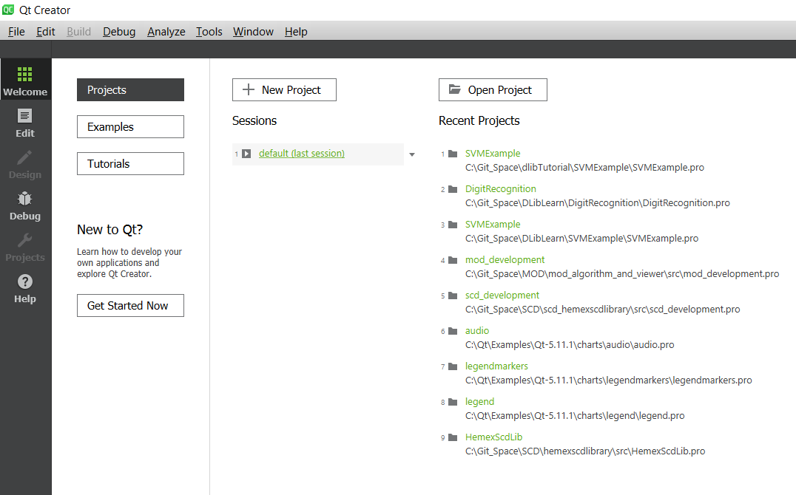
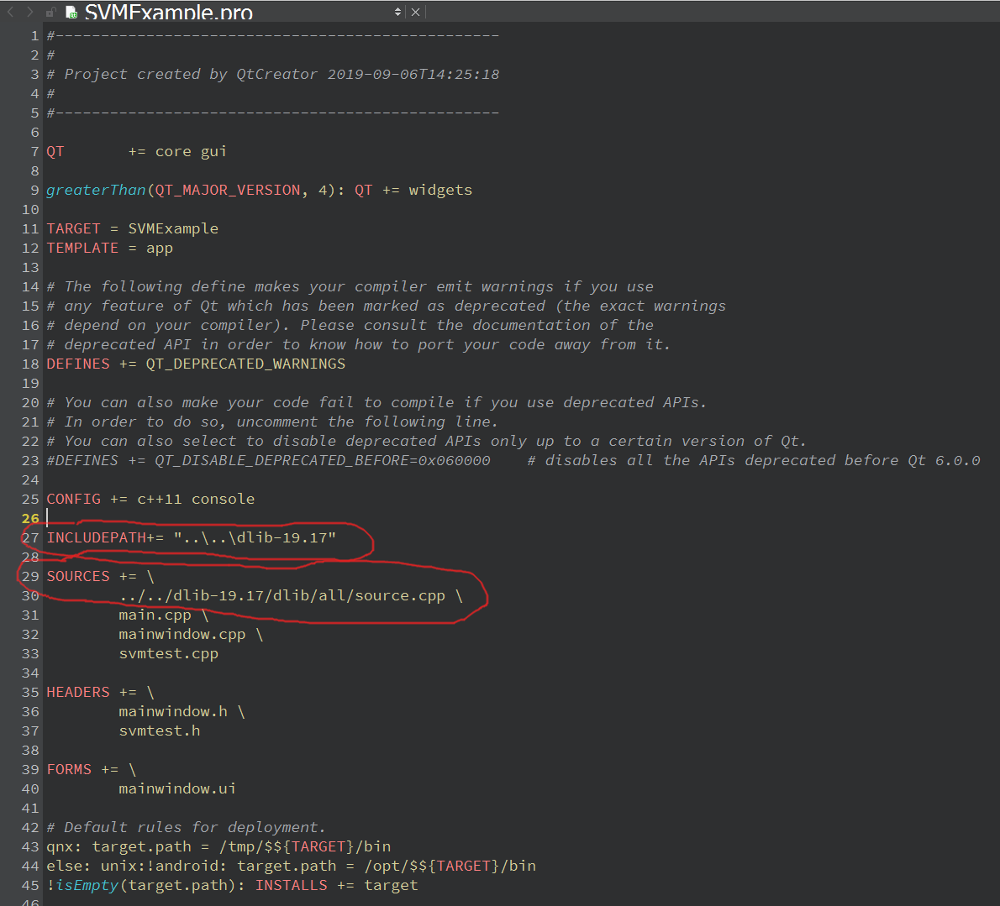
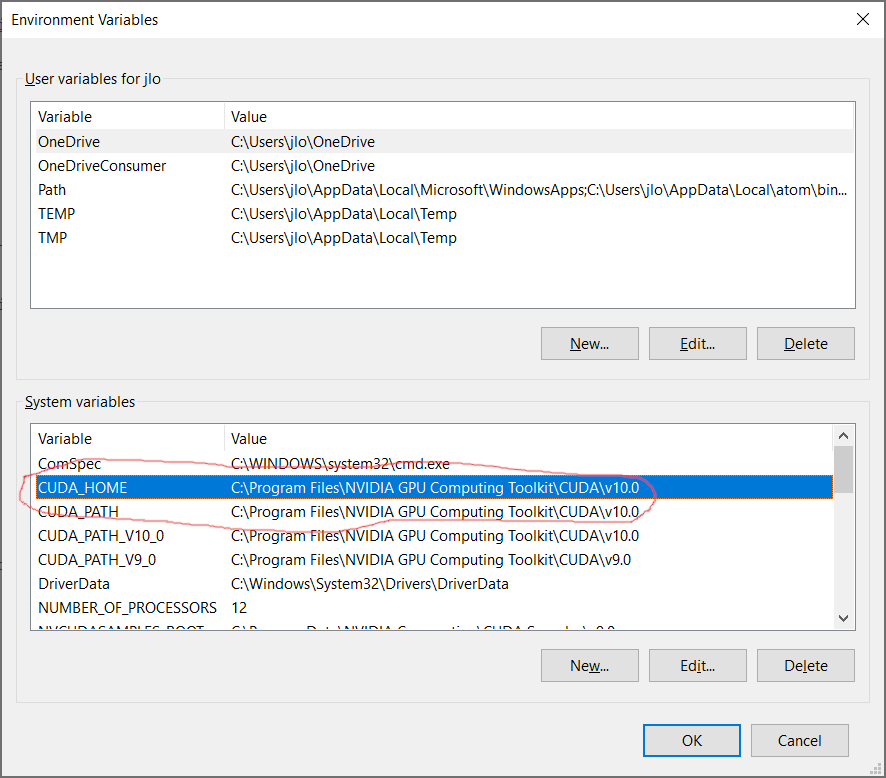
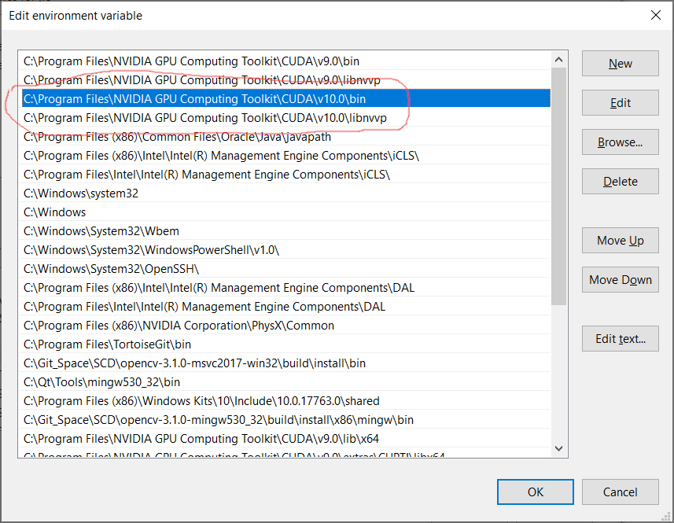
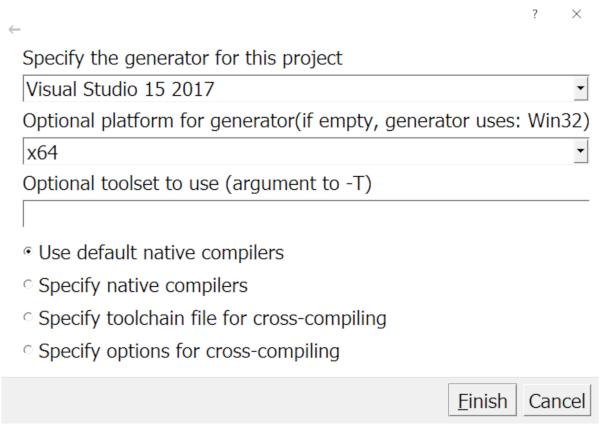
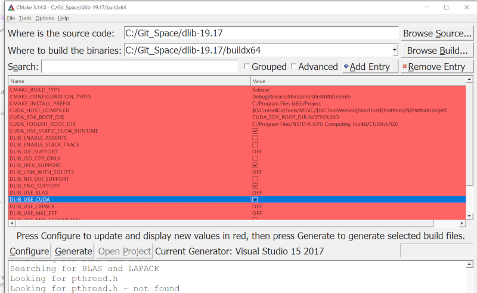
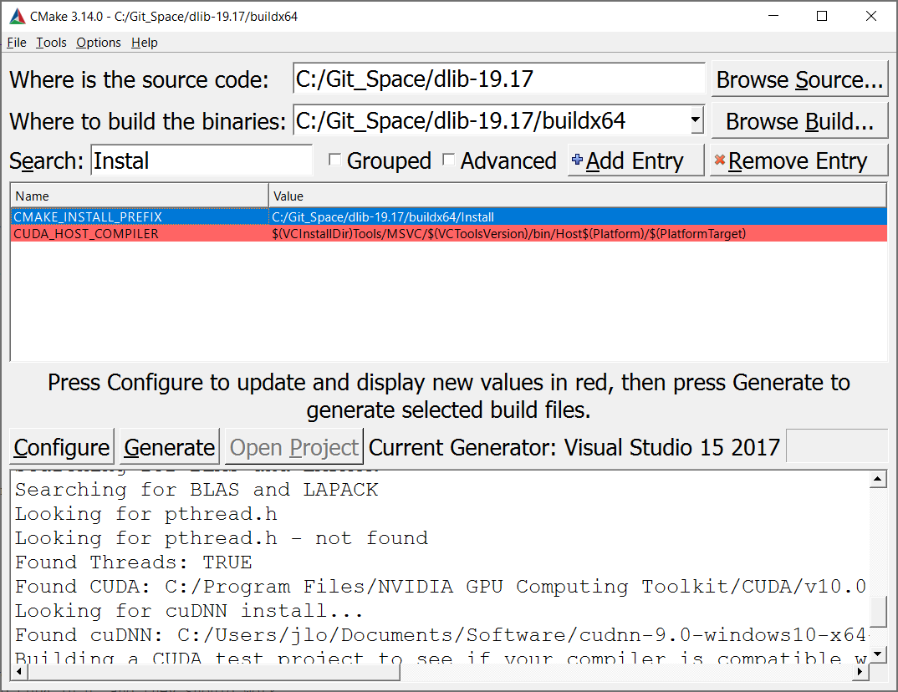

# dlibTutorial
C++ dlib simple tutorial. The tutorials in this repo are based on the examples from dlib official website.
(http://dlib.net/). It is focused on setting up dlib projects using Qt creator and MSVC compiler. 

## Development Environment 

- Qt 5.12.4
- Qt Creator 4.9.2
- MSVC 2017
- CMake 3.14.0
- CUDA 10.0
- cudnn 7.5.1.10 for CUDA 10.0

## Download dlib source file

Download the source zip file from dlib website (http://dlib.net/). Unzip it and place to a local directory of your 
choice. 


## dlib setup

To use the dlib, please refer to the dlib official compile page (http://dlib.net/compile.html) for details.

Depending on whether to use CUDA or not, the setup procedure for dlib is different. Here are some simple steps
to set up dlib for both options:

### Setup a Qt project using dlib with **CPU ONLY*:

1. Open Qt and click New Project to create a new project
   

2. After creating the project, in the project file:
	- Add the main folder to the include path (for example: INCLUDEPATH+= "..\..\dlib-19.17") 
	- Add the /dlib/all/source.cpp to the project
	
	Here is an example, the dlib main folder is **dlib-19.17** and its relative location with the project folder
	is like following:
	
	./dlib-19.17
	
	./Workspace/ThisProject
	
	
	
3. Then the project should be ready to go!

### Setup a Qt project using dlib with **CUDA** support

It is more involved to setup a Qt project using dlib with CUDA support. The three major steps are:

a. Compile the dlib library with CUDA 
b. Link the built dlib library to the Qt project
c. Link the CUDA and cudnn library to the Qt project

Now let's go into the details for each step:

#### a. Complie the dlib library with CUDA

- Install **CMake** if it is not installed yet (https://cmake.org/download/).
- Install **CUDA** and **cudnn**. Make sure the cudnn is compatible for the CUDA version. Also make sure the C++ compiler
  is compatible with the CUDA version. In my case, I use MSVC 2017 C++ compiler and CUDA 10.0, and they should work 
  with each other.
- After installing CUDA, set the environment variable **CUDA_HOME** and **CUDA_PATH** as the CUDA installation directory. It should 
  be something like  **C:\Program Files\NVIDIA GPU Computing Toolkit\CUDA\v10.0**
- Also add the CUDA **bin and libnvvp** installation directory into the **Path** environment variable.   



- Open CMake. Specify the dlib source folder and build folder. 
- Click **Configure** button. A window will pop up for selecting the compiler. Remember to select **x64**

- Make sure the **DLIB_USE_CUDA** is **checked** after configuring. If it shows **OFF**, it means the CUDA version and compiler 
  version are compatible so that the compiler can not compile the CUDA test project. 

- Set the **CMAKE_INSTALL_PREFIX** to the local folder of your choice. The library files, configuration files, and include source codes
will be installed to this folder after dlib compilation. It is important to run the **INSTALL** project so that dlib can be 
correctly set up. Later on the Qt project will link to the dlib library from the **installed** folder.

- Click **Generate** then **Open Project** to open the dlib project in Visual Studio
- Compile the solution in **Release** mode (the **Debug** mode will not work since the CUDA library is release library) and remember 
to run the **INSTALL** project for copying the files to the install folder.

#### b. Link the built dlib library to the Qt project

Add something similar to the following in the Qt project file

```
# ===== 64bit dlib =====
win32:CONFIG(release, debug|release): LIBS += -L$$PWD/../../dlib-19.17/Install/lib/ -ldlib19.17.0_release_64bit_msvc1916
else:win32:CONFIG(debug, debug|release): LIBS += -L$$PWD/../../dlib-19.17/Install/lib/ -ldlib19.17.0_debug_64bit_msvc1916

INCLUDEPATH += $$PWD/../../dlib-19.17/Install/include
DEPENDPATH += $$PWD/../../dlib-19.17/Install/include

win32-g++:CONFIG(release, debug|release): PRE_TARGETDEPS += $$PWD/../../dlib-19.17/Install/lib/libdlib19.17.0_release_64bit_msvc1916.a
else:win32-g++:CONFIG(debug, debug|release): PRE_TARGETDEPS += $$PWD/../../dlib-19.17/Install/lib/libdlib19.17.0_debug_64bit_msvc1916.a
else:win32:!win32-g++:CONFIG(release, debug|release): PRE_TARGETDEPS += $$PWD/../../dlib-19.17/Install/lib/dlib19.17.0_release_64bit_msvc1916.lib
else:win32:!win32-g++:CONFIG(debug, debug|release): PRE_TARGETDEPS += $$PWD/../../dlib-19.17/Install/lib/dlib19.17.0_debug_64bit_msvc1916.lib
```

#### c. Link the CUDA and cudnn library to the Qt project

Add something similar to the following in the Qt project file

```
# ===== 64bit cuda =====
win32: LIBS += -L$$PWD/'../../../Program Files/NVIDIA GPU Computing Toolkit/CUDA/v10.0/lib/x64/' -lcurand -lcudart -lcuda -lcublas -lcusolver

INCLUDEPATH += $$PWD/'../../../Program Files/NVIDIA GPU Computing Toolkit/CUDA/v10.0/lib/x64'
DEPENDPATH += $$PWD/'../../../Program Files/NVIDIA GPU Computing Toolkit/CUDA/v10.0/lib/x64'


win32: LIBS += -L$$PWD/../../../Users/jlo/Documents/Software/cudnn-10.0-windows10-x64-v7.5.1.10/cuda/lib/x64/ -lcudnn
INCLUDEPATH += $$PWD/../../../Users/jlo/Documents/Software/cudnn-10.0-windows10-x64-v7.5.1.10/cuda/lib/x64
DEPENDPATH += $$PWD/../../../Users/jlo/Documents/Software/cudnn-10.0-windows10-x64-v7.5.1.10/cuda/lib/x64
```
 
Then it should be ready to go! 
 


	
	
	
	


 
